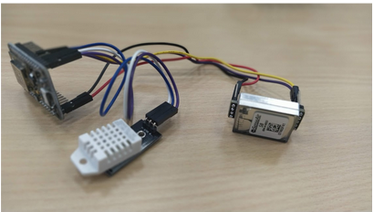
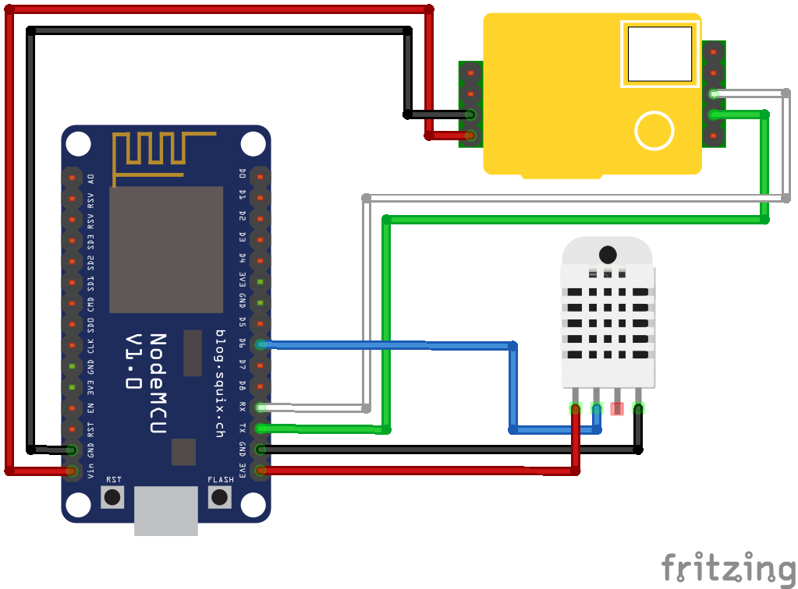
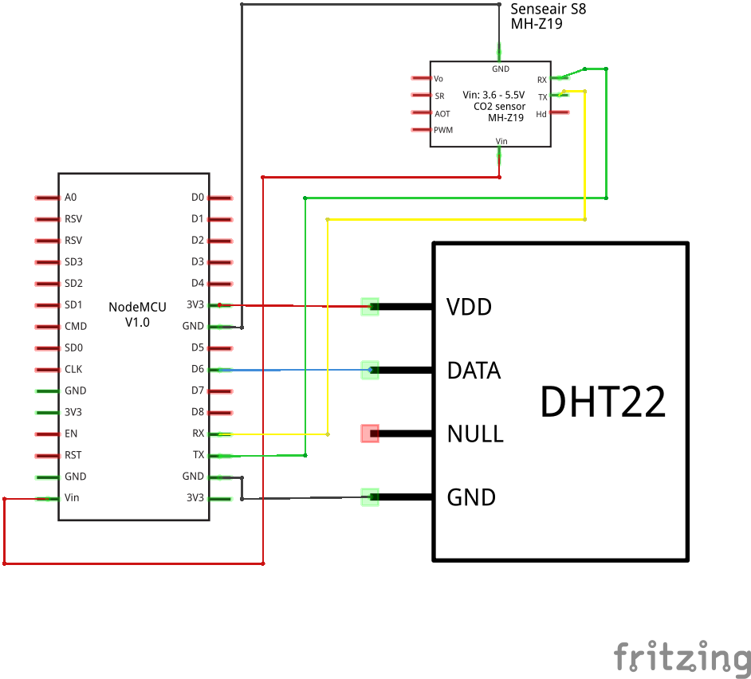
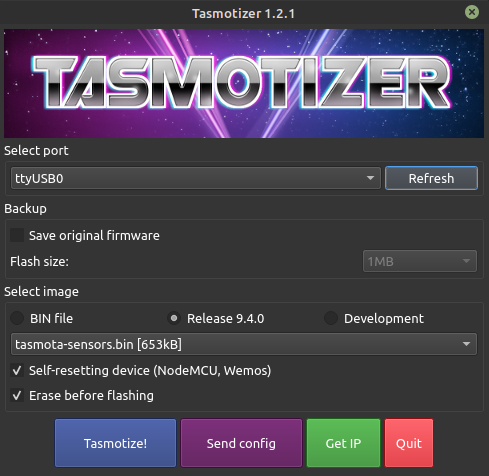
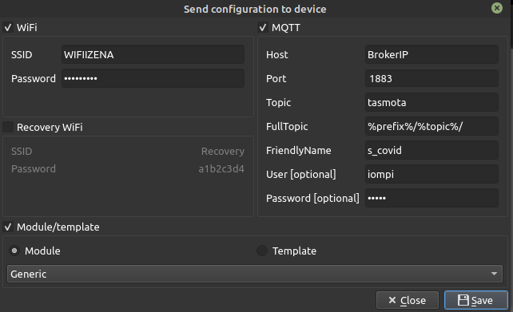
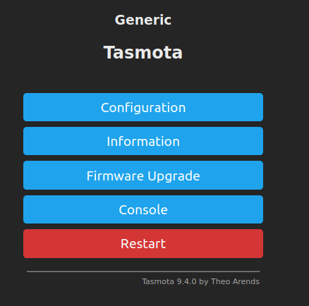
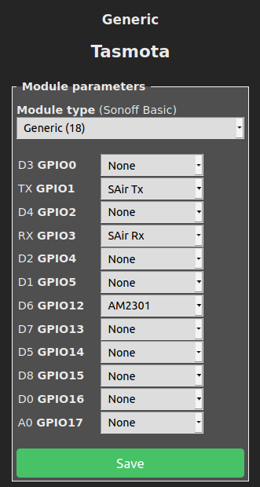

# SCovid


## Introduction

**SCovid** is a Nodemcu based sensor for CO2 monitoring. 

It has been developed mainly for teachers (educational environments), in order to facilitate the telemetry of CO2 level at school using [IoMBian OS](https://github.com/Tknika/iombian) project.


It measures the forwarding magnitudes. 

	 - CO2 level    pppm 
	 - Tenperature  ºC 
	 - Humidity     %
	 - DEW point    ºC
 



## List of elements
|Elements| Quantity | Link | 
|---|---|---|
| Sense Air S8| 1 |[Sense Air - Digi Key](https://www.digikey.es/product-detail/es/senseair-north-america-inc/004-0-0017/2194-004-0-0017-ND/10416536?utm_adgroup=Gas%20Sensors&utm_source=google&utm_medium=cpc&utm_campaign=Shopping_Product_Sensors%2C%20Transducers&utm_term=&productid=10416536&gclid=CjwKCAjwxuuCBhATEiwAIIIz0dKA79hlJd5p6Pi6lWrorZQlp4i2TtIozsbHxj0ZyZ9SqScUC76-VBoC6QgQAvD_BwE)|
| DTH22 AM2302| 1 |[DTH22 - Electroson](https://electroson.com/producto/arduino-sensor-temperatura-y-humedad/ARDHT22)|
| Nodemcu| 1 |[Nodemcu - Electroson](https://electroson.com/)|
| Female-Female headers| 17 ||

> **Warning**: Try to buy locally ```nearest store```.

## Scheme




  - (For a more detailed information, please refer to the following [link](https://senseair.com/products/size-counts/s8-residential/))


## Flashing progress

Download and install Tasmotizer software.  [link](https://github.com/tasmota/tasmotizer))




Follow the steps. 

	 - Flash tasmota-sensors.bin latest firmware
	 - Send hardware, wifi and MQTT configuration



	 - Get IP and open the Web configuration tool



Place sensors and nodemcu pinout according the schem.



## Last step

 - Be sure that correct readings are displayed on the tasmota we server.


## Authors

(c) 2020 [Tknika](https://tknika.eus/) ([Aitor Iturrioz](https://github.com/bodiroga) ,  [Aitor Azpiroz](https://github.com/axpirina))

Licensed under the Apache License, Version 2.0 (the "License");
you may not use this file except in compliance with the License.
You may obtain a copy of the License at

    http://www.apache.org/licenses/LICENSE-2.0

Unless required by applicable law or agreed to in writing, software
distributed under the License is distributed on an "AS IS" BASIS,
WITHOUT WARRANTIES OR CONDITIONS OF ANY KIND, either express or implied.
See the License for the specific language governing permissions and
limitations under the License.
